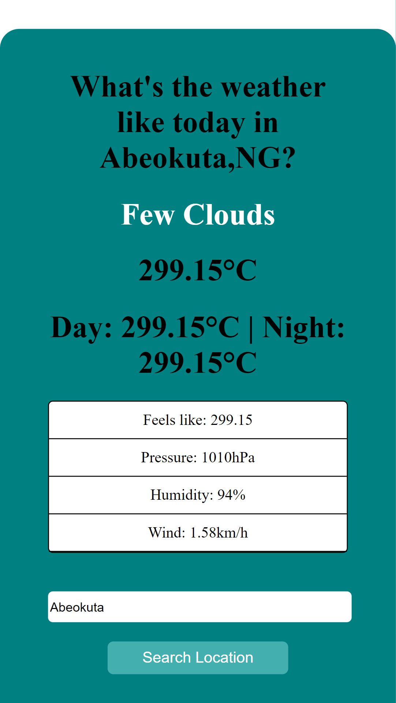

# weather_app
Weather Application with XMLHttpRequest

## Table of contents

- [Overview](#overview)
  - [The challenge](#the-challenge)
  - [Screenshot](#screenshot)
  - [Links](#links)
- [My process](#my-process)
  - [Built with](#built-with)
  - [What I learned](#what-i-learned)
  - [Continued development](#continued-development)
- [Author](#author)

## Overview

### The challenge

Users should be able to:

- View the optimal layout for the site depending on their device's screen size
- Check weather updates and info for locations

### Screenshot

### Links

- Live Site URL: [https://nostalgic-visvesvaraya-88b108.netlify.app/]

## My process

### Built with

- Semantic HTML5 markup
- CSS custom properties
- Flexbox
- CSS Grid
- Mobile-first workflow
- Javascript API

### What I learned

- This project expands my knowlegde of CSS Flexbox and grid 
- I learnt how to interact with API's

### Continued development

- Practice more with CSS GRid and Flexbox

## Author

- Website - [Oluwakemi Omoyeni](https://www.kemi.jwitedu.com.ng)
- Frontend Mentor - [@Captressketh001](https://www.frontendmentor.io/profile/@Captressketh001)
- Twitter - [@capketh](https://www.twitter.com/cap_keth)

